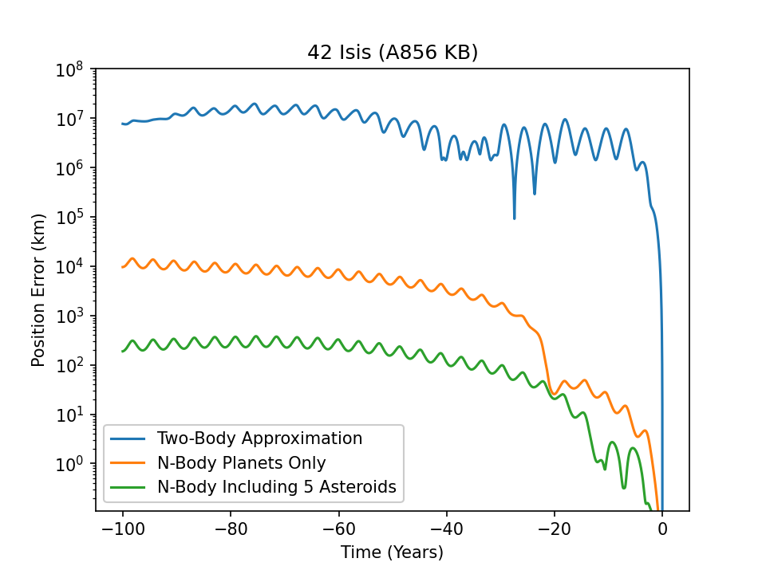
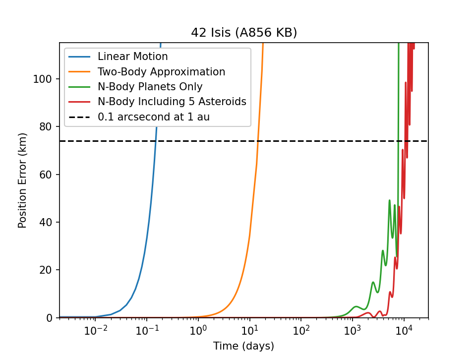

Orbit Propagation
=================

Orbit propagation can be an immensely complicated topic, spanning from two-body
Keplerian motion, to models of gravitational fields including thousands of terms. Being
able to pick the correct amount of precision required is difficult, and NEOSpy makes a
number of judicious choices which are reasonable for the vast majority of cases.

What follows is a discussion of the pros-cons of various models of gravitational forces,
and when the model is "good enough" for the problem at hand.

If we wish to predict the on-sky position or motion of an object, the level of precision
required depends greatly upon the distance which the object is from the observer.
Being accurate to 100nm when we are looking 5 au away is not necessary, alternatively, 
when we are considering an NEO such as Apophis (which will come very close to hitting
the Earth), meters matter.

    This is a plot of an arbitrary, rather large Main Belt Asteroid, and its orbital
    propagation error going back 100 years. Specifically error in orbit propagation
    comparing internal propagation against JPL Horizons SPICE kernels. This compares the
    difference in position for the two-body approximation, orbit propagation assuming
    there are no massive asteroids in the main belt, and finally including the 5 most
    massive main belt asteroids. Note that JPL Horizons includes at least 16 of the
    largest asteroids, so there is still residual error over the course of 100 years.
    This error however is only on the order of 100km.

Forces
------

First it is useful to list out forces which objects in space may experience, to get an
understanding of what is required in order to accurately model their motion. These are
listed in approximately the order of their effects on objects (though order may change
due to varying circumstances).

- *Newtonian Gravity* - Typically what is imagined when people say the force of gravity.
- *Corrections for Relativity (GR)* - The orbit of Mercury precesses due to effects from 
    relativity, and in fact many NEOs, or even objects which get close enough to planets
    will experience effects from relativity.  
- *Gravity from Minor Planets* - Main belt asteroids are often non-negligible.
    The motion of objects through the main belt often needs to include the mass of
    asteroids such as Ceres, which makes up an appreciable fraction of the total mass of
    the belt.  
- *Oblateness of the Sun/Planets* - The Sun and Planets are not ideal spheres, and as a
    result, cannot be exactly modeled as a point source. This non-sphericity can be
    written as an expansion of spherical harmonic-like terms, commonly written as `J`
    terms. The first non-trivial term of this expansion is the oblateness, referred to
    as `J2`. This term by itself will cause objects in orbit of the central mass to
    have their longitude of ascending node precess as a function of how inclined they
    are with respect to the equator of the central mass.  
- *Non-gravitational Forces* - The forces above are a result of gravity, however there
    are many potential forces which an object may experience, these include things such
    as outgassing, radiation pressure, the Yarkovsky effect, and the Poynting-Robertson
    effect. These effects typically have some relation to the total solar radiation that
    the object is receiving, and can frequently be written as a polynomial with respect
    to the distance that the object is from the Sun.

Accuracy
--------

Accuracy of the orbit propagation depends on how precisely the forces above are
computed, and the precision of the numerical integrator used. Forces such as the
Yarkovsky effect cause relatively small forces on asteroids, but will add up to be
non-negligible over the course of kilo-year or mega-years. A common issue however is
that we often don't have accurate enough measurements of the objects to be able to
accurately measure the contribution of these forces.  

Close encounters with other objects also cause significant accuracy issues as well. The
force between objects follows a `1/r^2` relationship, meaning as the distance goes to
zero, small changes in the distance cause large changes in the force. We do not have
infinitely precise measurements of the objects orbits, meaning there is some positional
error in our knowledge of every object. This error "blows up" during close encounters
because of the small `r` effect. Many objects which cross the path of planets frequently
will have relatively close encounters with planets with some regularity, making long
term predictions of their orbits difficult. Typically it only takes a few close
encounters to completely ruin any hope of predicting the position of an object in the
future or past. This makes the inner solar system a chaotic system in the mathematical
sense, small deviations of input parameters have large implications for future behavior
(despite the fact that everything should in theory be precisely computable).  

The result of the problems above, objects in the inner solar system of often very
difficult to model more than a few hundred/thousand years into the future with any
accuracy.

Performance
-----------

To achieve the highest accuracy, all forces listed above must be included. The downside
for this is that it can be computationally expensive. If we wish to predict the position
of minor planets for NEOWISE frames as an example, which are captured every 10-15
seconds, it would be wildly inefficient. Over the course of a few minutes objects motion
can be modeled as linear, over hours (even days) the two-body approximation is often
good enough. As a result of this, NEOSpy has tools for adaptively changing the
approximation used in order to get good computational performance. The typical method is
to use a full N-Body simulation to get the highest precision, then use that solution for
the next day or so (adjustable) with two-body mechanics to query hundreds of times.

    Demonstration of how quickly linear motion, two-body motion, and N-Body deviate from
    the true position over the course of a few weeks. Linear motion is invalid within a
    few minutes, but two-body takes several days for this object to become significantly
    inaccurate. The dotted black line is how far an object must move tangentially to
    have an error of 0.1 arcseconds when it is 1 au from the observer (about 74km).
