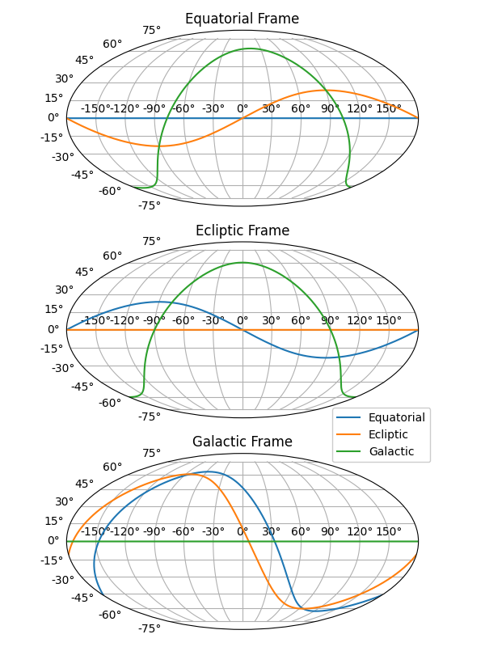

Background Reading
==================

Coordinate Frames
-----------------

Coordinate frames define the X/Y/Z axis required to represent position and velocity.
In kete, coordinate frames only define the direction of the X/Y/Z axis, and not the
origin of the coordinate system. This is to say, these frames are only relative
definitions, and the object from which they are relative to must also be kept track of.
Additionally, all coordinate frames within kete are treated as inertial, meaning there
is no funny business regarding accelerating frames such as a rocket.

There are several common definitions of coordinate frames in astronomy, here are some
popular choices:

    - **Equatorial** - The X-Y plane is defined by the celestial equator (Earth's
      Equator). The x-axis is defined pointing to the Vernal Equinox (IE: where the
      Sun crosses the equator in the northward direction).
    - **Ecliptic** - The X-Y plane is defined by the plane of the Earth around the Sun,
      where the x-axis is defined as the same vector as the Equatorial frame. This in
      essence means that conversion between the two is a rotation around the x-axis by
      some angle (more on that later).
    - **Galactic** - The X-Y plane is defined to be the galactic plane, there is a
      non-trivial conversion and definition for this frame.

At first glance these definitions appear relatively precise, however they are not. The
issue is with the definition of the Vernal Equinox. As the Earth orbits the sun, its
axis of rotation precesses, meaning the exact position of the Vernal Equinox slowly
moves. The common solution to this is to define a date at which we calculate the Vernal
Equinox. These dates include the common J2000 or older dates such as B1950 or B1900.

Picking the date however only fixes one issue, that of the X-axis. However the variation
of Earth's equatorial plane affects the conversion from Equatorial and Ecliptic as well.
The typical solution is to always fix the Ecliptic Plane definition as the one at J2000,
but it is important to note that in reality the angular difference between the Ecliptic
and Equatorial planes are constantly varying.

The above then provide reasonable definitions for the X/Y/Z frames, but skip over an
important step, actually determining where we are in the orbit of the Sun. If the
Universe was made up of only the Sun and Earth, it would be extremely difficult to tell
that we orbit it. In order to really see our motion around the Sun, we typically
use deep sky reference points. The current modern standard is the ICRF references, which
were defined using measurements from the GAIA mission. Historically there are older
reference sets, such as FK5, which perform the same function with less precision.

kete uses the Ecliptic Frame, at the J2000 Reference point, with units of AU and
AU/Day. These largely match the definitions used by JPL Horizons and the MPC.

Time
----
Keeping track of time is a famously difficult problem. Unfortunately when observing
solar system objects which are flying by the observer, getting the time correct turns
out to be extremely important. First, let's pick a unit of time to use, kete uses
Days. Trouble immediately arises as time is observer-dependent, observers on the ground
experience a different rate of time than those outside of the solar system. This is
typically called the time Scale, the time scale which the Minor Planet Center and JPL
Horizons uses is called the Barycentric Dynamical Time (more frequently called `TDB
<https://en.wikipedia.org/wiki/Barycentric_Dynamical_Time>`_), which is fundamentally
different from time on the surface of the Earth, Terrestrial Time (TT). These two
scales are as closely related to one another as is reasonable, however, there are small
differences with respect to one another which are mainly periodic (on the order of a
few milliseconds).

Examples of time scales (roughly in order of creation):

  - **TAI** - Time measured by atomic clocks on the surface of the Earth. This is
    strictly monotonically increasing time, and is the basis for measurement of all
    time.
  - **Terrestrial Time (TT)** - Basically defined by 1 second on an atomic clock on
    Earth's surface. It is a more modern equivalent to UT. Using the SI units
    definition of a second. This is by definition offset from TAI by 32.184 seconds.
  - **Universal Time (UT or UT1)** - Time scale based upon Earth's rotation with
    respect to the ICRF reference frame. This is one of the oldest definitions.
    Unfortunately, Earth's rotation rate varies slightly over time, due to this, this
    definition slowly drifts from TT on a yearly basis. It can only be measured,
    predicting it with accuracy is currently impossible. This is an inconvient system
    when a regulatory agency is attempting to broadcast time to the world, as it is
    constantly changing. A result of this was the creation of the UTC system.
  - **Coordinated Universal Time (UTC)** - Equivalent scaling as Terrestrial Time(TT)
    however, they are offset by ~32.184 seconds (this amount varies due to leap
    seconds, which are covered below).
  - **Ephemeris Time (ET)** - An attempt to fix the UT time to correct for Earths
    rotation rate variance. This has been replaced by more modern scales. This has
    been largely replaced by TDB time.
  - **Barycentric Dynamical Time (TDB)** - Basically defined as 1 second of an atomic
    clock in the reference frame of the Solar System, but outside of gravitational
    fields. However an offset has been applied to make it as close to TT as is
    reasonably possible. This is the current reference time which JPL Ephemeris
    uses.

In addition to the rate of passage of time (scale), it is necessary to pick the 0
point. Examples of this include the Julian Date (JD) or the Modified Julian Date (MJD).
The 0 point for JD is defined as Noon, UT1, January 1, 4713 BC (MJD is the same but
2400000.5 days later). Predicting UT1 at that time is infeasible however, as the rate
or rotation of the Earth is not constant, JPL uses TDB as the scaling in this case.
J2000 is another common offset, which is 0 at Noon on January 1st, 2000 with TDB Time
Scaling. J2000 is also often used in other definitions as well, it sometimes may be
used in literature to signify a coordinate frame in addition to time.

UTC - Some discussion should be given to UTC, as it is one of the more complicated
systems. UTC scales the same as TAI/Terrestrial Time, which is to say in lockstep with
atomic clocks. Unfortunately, Earth's rotation doesn't always agree with this rate. 
UT1, one of the predecessors to UTC, has a constantly varying value which represents
this drift. This constant, sub-second drift was originally broadcast as an updated
time offset from the TAI time. As one would imagine, this turned out to be infeasible,
so some rounding was applied, and UTC was created. UTC's solution to this problem is to
periodically introduce `Leap Seconds`, where instead of a constant continuous shift, a
second is either added or subtracted to when UT1s difference from the current UTC value
has exceeded a full second.
This leads to two distinct problems, 1) It is not possible to predict when a leap second
will need to be added, and 2) it is technically possible for the same second to occur
twice ( fortunately, this has not happened yet). Leap seconds have been enough of an
issue that at the time of writing this document, they are considering doing away with
them in the future (all previously defined leap seconds won't be removed, only future
ones). Since it is not possible to predict the location of leap seconds, planning time
dependent operations in the future have the added complexity that they may have an
additional second added in after planning has occurred.

kete uses the TDB Scaling, with JD as the 0 point for timekeeping, however there is a
`Time` object which enables conversion to and from several time-keeping system.

Asteroid Names
--------------
The naming of asteroids is a surprisingly difficult topic and the Minor Planet Center
(MPC) has several different conventions. When a new asteroid is potentially found, it is
assigned a  Provisional Designation. It is possible for a number of reasons for a single
object to actually have multiple provisional designations (for example 2 short
observation arcs of the object which later get linked together, each would initially
receive their own designation). Due to this, the MPC has a "preferred" provisional
designation for objects. Once there are a sufficient number of observations of an object
it is then assigned a Permanent Designation, which is an integer starting at 1 counting
up. There are hundreds of thousands of objects which have Provisional Designations which
do not have Permanent ones.

An additional confusion that occurs is that these Permanent and Provisional each have
two ways of being written. Due to historical reasons, these designations had to be able
to be packed into a reduced-length text string. In kete, these two are referred to as
Packed or Unpacked designations. There is a strict 1-to-1 mapping from the packed to the
unpacked.

Using Ceres as an example, its permanent designation is `1`, which may be packed into
`00001`. Ceres also has 4 different provisional designations, each with its own packed
provisional text representation. Making a minimum of 10 different ways it is possible to
record the name.

Comets have all of the complexity of the Provisional Designations above but have the
additional problem that they have a tendency to fragment. Fragments of a comet are
assigned the same name with the additional letter at the end.