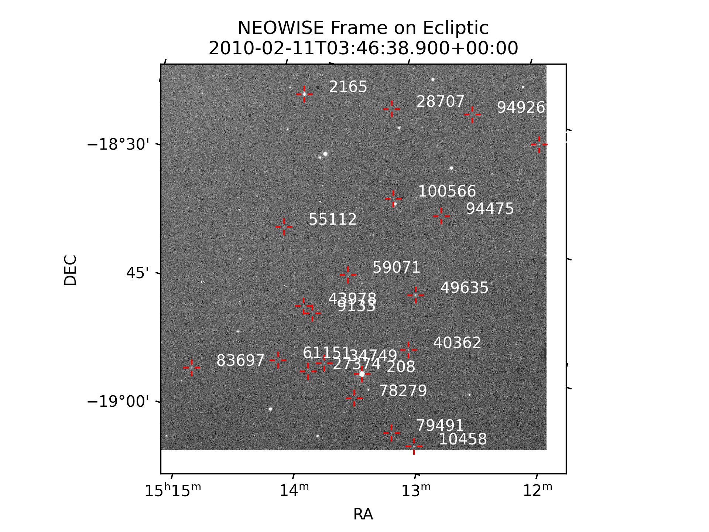

Known Object Name Association (KONA)
====================================

Known Object Name Association (KONA), takes a given field of view and computes what
objects are contained within it. This is a relatively expensive operation, and is more
efficiently done with many images at once, preferably as close together in time as
possible.

First we do some setup, including importing many needed packages.

.. code-block:: python

    import neospy
    import matplotlib.pyplot as plt
    import numpy as np
    import datetime
    import warnings

    import astropy
    from astropy.io import fits
    from astropy.wcs import WCS

FITs File
---------

First we load a FITs file, and grab frame information from its header.
Observer position is loaded from this file, and the edges of the field of view are
calculated from the corners of the frame.

.. code-block:: python

    frame = fits.open("data/01772a127-w3-int-1b.fits.gz")[0]

    # Here we compute a State of the observer, this could also be constructed
    # using spice kernels using neospy.SpiceKernels.state
    sc_pos = neospy.Vector([frame.header['SUN2SCX'],
                            frame.header['SUN2SCY'],
                            frame.header['SUN2SCZ']],
                        neospy.Frames.Equatorial)
    sc_vel = neospy.Vector([frame.header['SCVELX'],
                            frame.header['SCVELY'],
                            frame.header['SCVELZ']],
                        neospy.Frames.Equatorial)

    # Load the time
    time = datetime.datetime.fromisoformat(frame.header['DATIME'])
    time_jd = neospy.Time(time, "datetime", scale='utc').jd

    # Now there is a final state of the observer
    sc_state = neospy.State("WISE", time_jd, sc_pos, sc_vel)

    # Build the corner position of the FOV in RA/DEC, and build those into vectors
    # The WCS will raise a warning because the FITs files produced by WISE use an
    # old format.
    with warnings.catch_warnings():
        warnings.filterwarnings("ignore")
        frame_wcs = WCS(frame.header)
    corners = []
    dx, dy = frame_wcs.pixel_shape
    for x, y in zip([0, 0, dx, dx], [0, dy, dy, 0]):
        coord = frame_wcs.pixel_to_world(x, y).icrs
        corners.append(neospy.Vector.from_ra_dec(coord.ra.deg, coord.dec.deg))

    # Build a generic FOV from the corners and the state of the observer
    fov = neospy.fov.RectangleFOV.from_corners(corners, sc_state)

MPC Orbit Data
--------------

Next we must collect orbit information from the Minor Planet Center (MPC).
We will load all known objects from their database, convert them to a Neospy State,
and propagate those states to the epoch near the FITs file epoch we opened.

.. note::
    This takes about 10-15 minutes to run on a powerful desktop, as it is performing
    orbit propagation using full N-Body mechanics of all planets with corrections for
    general relativity. This is propagating the *entire* MPC catalog more than 14
    years.

.. code-block:: python

    # Load orbit data from the MPC
    mpc_obs = neospy.mpc.fetch_known_orbit_data()

    # Convert that data to State objects.
    mpc_states = neospy.mpc.table_to_states(mpc_obs)

    # It takes a while to propagate 1.5 million asteroids 14 years...
    mpc_states = neospy.propagate_n_body(mpc_states, time_jd)

Geometry Checks
---------------

Calculate what is visible in the frame. Note that this actually accepts any number of
frames, and it is strongly recommended to give it all your FOVs of interest at one
time. It will be significantly more efficient in its computation. Here we only give it
one, and then immediately take the single result back out.

.. code-block:: python

    visible_obj = neospy.propagation.state_visible(mpc_states, [fov])[0]

Results
-------

Plot the first `n_show=20` objects which were found in the field, but note that 181
known objects have landed in this single FITs frame! That is perhaps unsurprising, as
this fits frame is on the ecliptic plane.

.. code-block:: python

    n_show = 20
    print("Found: ", len(visible_obj))
    print(f"Showing top: {n_show}")
    print(f"{'Name':<15}{'RA':<15}{'DEC':<15}")
    print("-"*45)
    for state in list(visible_obj)[:n_show]:
        vec = (state.pos - visible_obj.fov.observer.pos).as_equatorial
        print(f"{state.desig:<15s}{vec.ra_hms:<15s}{vec.dec_dms:<15s}")

::

    Found:  181
    Showing top: 20
    Name           RA             DEC            
    ---------------------------------------------
    208            15 13 39.750   -18 50 09.19   
    2165           15 14 46.682   -18 19 27.84   
    9133           15 14 12.433   -18 44 42.05   
    10458          15 13 04.461   -18 56 52.80   
    27374          15 14 06.710   -18 51 36.23   
    28707          15 14 01.718   -18 18 21.01   
    34749          15 13 59.847   -18 50 07.33   
    40362          15 13 20.138   -18 45 50.81   
    43978          15 14 17.811   -18 44 08.75   
    49635          15 13 24.106   -18 39 13.03   
    55112          15 14 38.357   -18 35 33.63   
    59071          15 14 00.190   -18 39 04.66   
    61151          15 14 23.124   -18 51 16.34   
    78279          15 13 40.347   -18 53 13.99   
    79491          15 13 17.275   -18 56 03.61   
    83697          15 15 04.631   -18 54 58.32   
    94475          15 13 22.326   -18 29 11.79   
    94926          15 13 21.235   -18 16 25.15   
    100566         15 13 48.386   -18 28 44.83   
    101066         15 12 44.205   -18 17 42.32

Plotting
--------

Now take the same results from above an plot the fits file with the overlaid positions.
Note again this is only showing the first 20 of 181.

.. code-block:: python

    plt.figure(dpi=300)
    wcs = neospy.irsa.plot_fits_image(frame, cmap='grey')
    for state in list(visible_obj)[:n_show]:
        vec = (state.pos - visible_obj.fov.observer.pos).as_equatorial
        neospy.irsa.annotate_plot(wcs, vec.ra, vec.dec, state.desig, px_gap=10, length=10)
    plt.xlabel("RA")
    plt.ylabel("DEC")
    plt.title(f"NEOWISE Frame on Ecliptic\n{neospy.Time(time_jd).iso}");
    plt.savefig("data/kona.png")
    plt.close()

