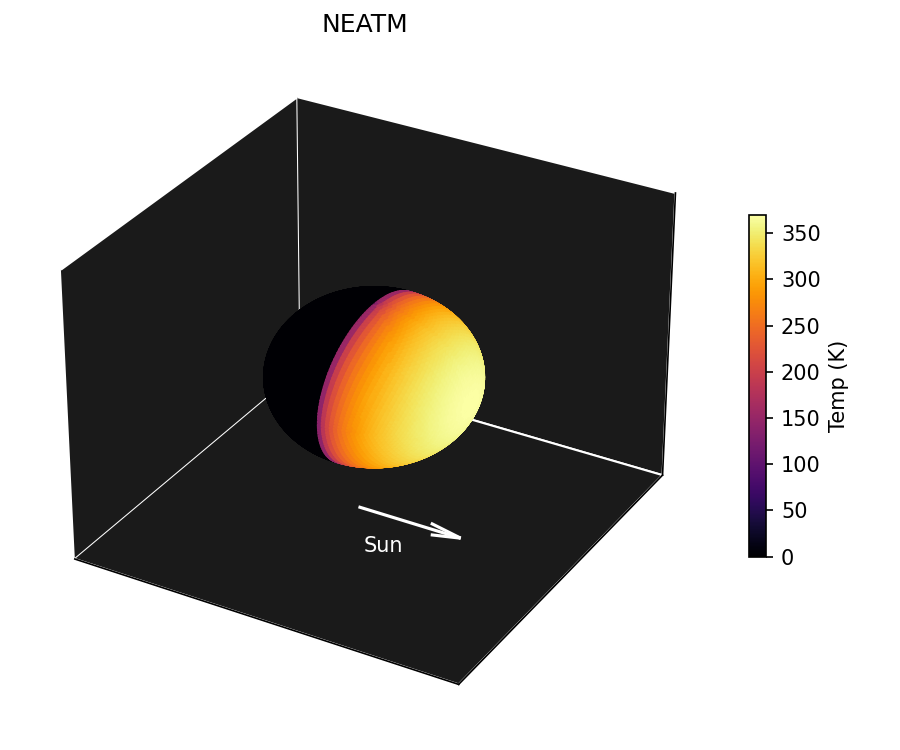
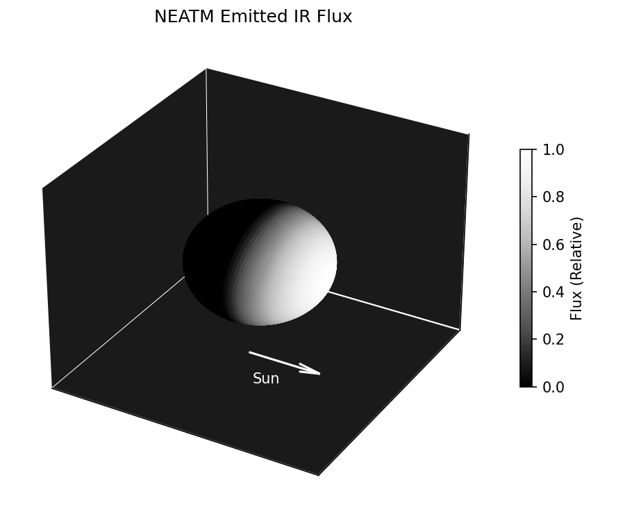
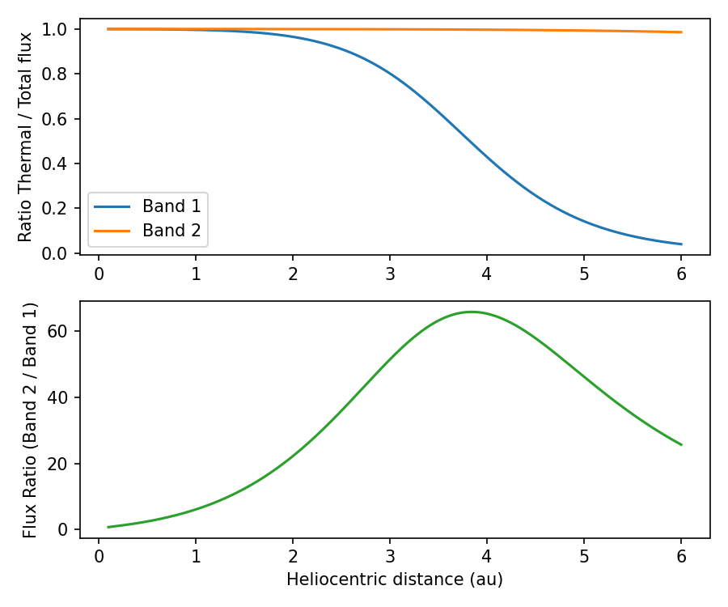

Near Earth Object Thermal Model (NEATM)
=======================================

The Near Earth Asteroid Thermal Model (NEATM) is, as its name suggests, a thermal model
of Near Earth Asteroids (NEAs). NEATM has a small number of parameters, meaning it
works best in the regime where there is limited data on an asteroid. However as is
common with any numerical model with a small number of parameters, many approximations
and assumptions have been made which may not always be correct. Despite these
limitations, NEATM has been successfully used to estimate with reasonable accuracy the
diameter of thousands of asteroids, both NEAs and main belt.

NEATM models an asteroid as a perfect Lambertian non-rotating sphere which is heated by
the Sun. Because the sphere is not rotating, the night side of the asteroid is treated
as having no emission at all. Clearly these are an idealized set of assumptions, which
the model acknowledges by introducing an additional parameter called "Beaming", a
catch-all correction scaling factor to allow the model to adjust for the surface
properties, rotation effects, and geometry.

There is a non-linear relationship between surface temperature and emitted flux (IE:
black body radiation), meaning that the above surface temperature map is not equivalent
to the visible flux from the surface. The plot below is the actual flux seen from the
observer in the WISE W3 band, notice that there is a much more gentle falloff near the
terminator.

In the original description of NEATM, all visible flux from the asteroid is due to
black body thermal emission from the heated surface. However this neglects the fact
that the Sun emits light in the IR as well. This Solar emission of IR is reflected from
the surface, and for colder asteroids can contribute a significant fraction of the
total flux. NEOSpy automatically includes this reflected light flux alongside the
thermal emission.

Below is an example of how to compute NEATM using NEOSpy, showing the relative
contribution of thermal and emitted fluxes.

.. code-block:: python

    import neospy
    import matplotlib.pyplot as plt
    import numpy as np

    # Using NEOS wavelengths
    bands = neospy.neos.BANDS

    observer = [0, 1, 0]

    # Define the NEATM model parameters for an object
    params = neospy.flux.NeatmParams(
        "Ceres",
        band_wavelength=bands,
        band_albedos=[0.1] * len(bands),
        h_mag=3.34,
        diam=939.4,
        g_param=0.12,
    )

    # Define some observing geometry, this can be calculated using orbital
    # propagation code in neospy.
    distances = np.linspace(0.1, 6, 1000)
    sun2obj_vecs = [[r, 0, 0] for r in distances]
    sun2obs_vecs = [observer] * len(sun2obj_vecs)

    # Evaluate NEATM at these geometries
    outputs = params.evaluate(sun2obj_vecs, sun2obs_vecs)

    plt.figure(figsize=(6, 5), dpi=150)
    plt.subplot(2, 1, 1)
    for band_idx in range(len(bands)):
        therm_flux = [o.thermal_fluxes[band_idx] for o in outputs]
        total_flux = [o.fluxes[band_idx] for o in outputs]

        ratio = np.array(therm_flux) / total_flux
        plt.plot(distances, ratio, label=f"Band {band_idx + 1}")

    plt.ylabel("Ratio Thermal / Total flux")
    plt.legend()

    plt.subplot(2, 1, 2)
    fluxes = np.array([o.fluxes for o in outputs]).T

    plt.plot(distances, fluxes[1] / fluxes[0], c="C2")

    plt.xlabel("Heliocentric distance (au)")
    plt.ylabel("Flux Ratio (Band 2 / Band 1)")
    plt.tight_layout()
    plt.savefig("tutorials/NEATM_ratios.png")
    plt.close()

The lower figure is the ratio of the fluxes from Band NC2 / NC1 of NEOS.