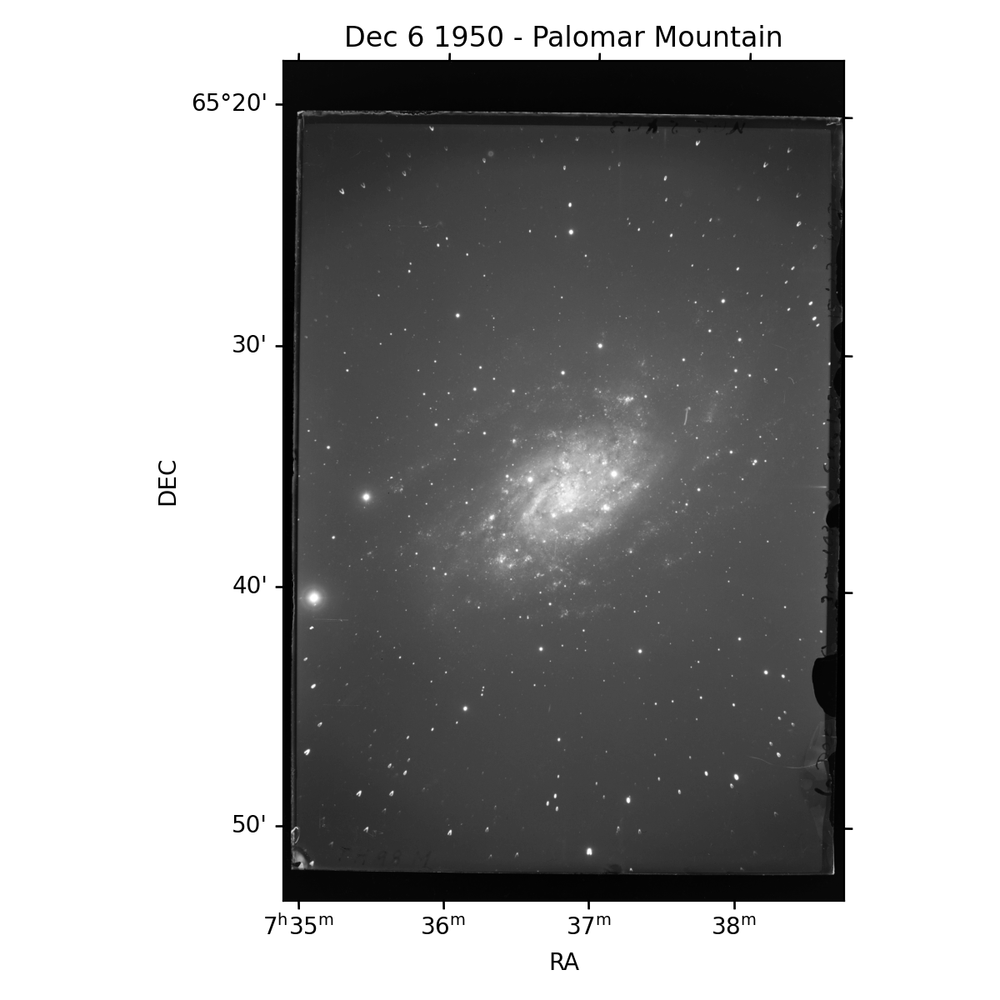
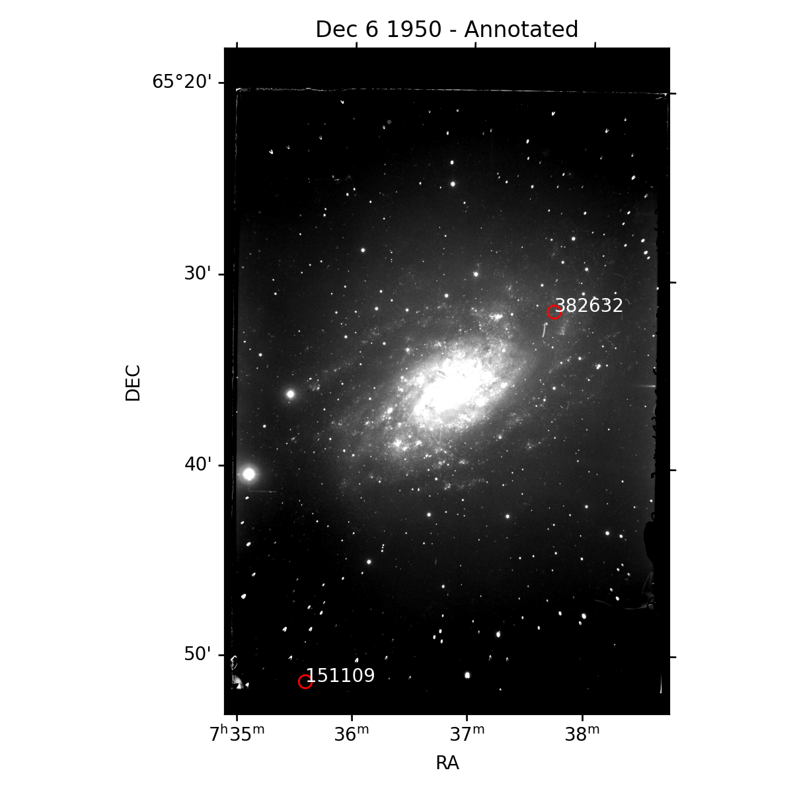
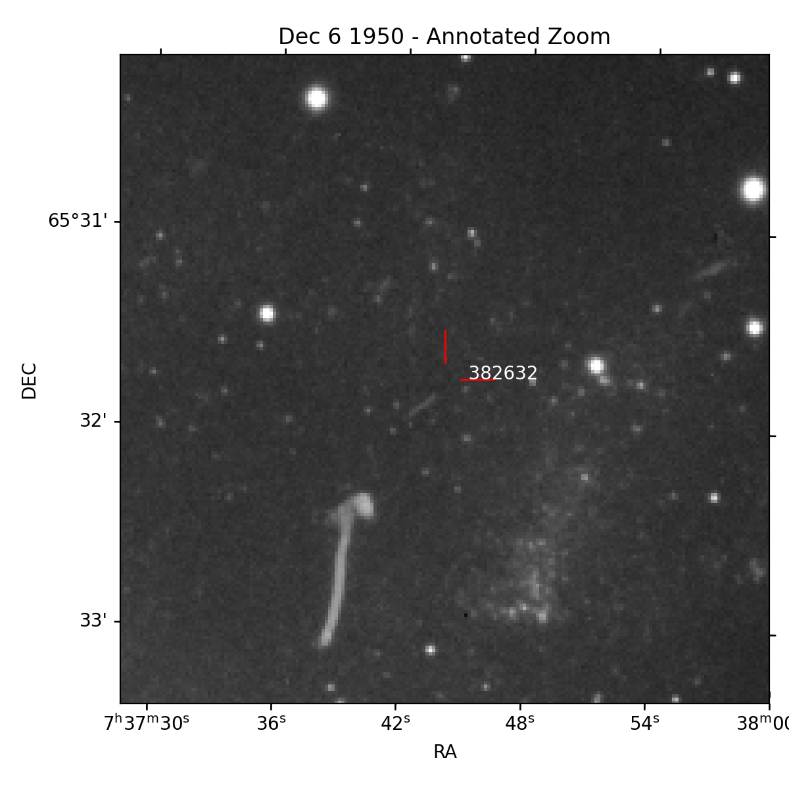

Palomar 1950 Plate
==================

Identification of an asteroid in a glass plate exposure from 1950 Palomar Mountain.

Background
----------

On December 6th and 8th 1950, Rudolph Minkowski captured 2 long exposure images
onto glass plates of the galaxy NGC2403 looking for time varying sources. On the
cover slip for these plates was written "Asteroid", and an arrow was drawn on the
plate identifying the streaking asteroid on the plates themselves. Details of the
observations are included in
`Tammann & Sandage (1968) <https://doi.org/10.1086/149487>`_ in their Table A1,
although plate PH-98M is incorrectly listed as PH-98H (with the ending letter
indicating the observer). These plates were exposed for approximately 30 minutes
(although cloud cover reduced the exposure toward the end for one plate).

These plates are stored at the Carnegie Science Observatories in Pasadena in their
archives. One of Carnegie's Archivists, Kit Whitten, provided a scanned copy of
the frames to Joe Masiero at CalTech IPAC around 2018. Masiero provided them for
the following analysis.

Here we will identify that asteroid which Minkowski captured over 70 years ago.

Pre-processing
--------------

Some pre-processing was done on the scanned image before this analysis. First the
data was binned by a factor of 8 in both axis to reduce the file size. Second it
was passed to astrometry.net for a plate solution. This gives a valid WCS to work
with, which is practically a requirement. Since the image was as scan of a
film negative, it was also inverted.

Limitations
-----------

- Astrometry.net is using the current star catalog, meaning if there are stars in
  the field which have moved measurably, then the astrometry will be imperfect.
- Observer position before 1972 is somewhat tricky to compute, and is currently not
  well supported in Kete. This is a result of NASA NAIF (Navigation and Ancillary
  Information Facility) only producing Earth orientation files back to about 1972.
  This information can be calculated by other means with less precision, but this
  is not currently implemented. As a result of this, the center of the Earth is used
  as an approximation for the observers position, but this results in about an
  arc-minute offset in calculated positions. Adding a better approximation of the
  observer location shifts the results to sub PSF accuracy.
- Record keeping of the exact time appears to be off by a few minutes, though this
  may be an artifact of the observer position being approximate.

FITs File
---------

First we load a FITs file, and grab frame information from its header.

.. code-block:: python

    import kete
    import matplotlib.pyplot as plt
    import numpy as np

    from astropy.io import fits
    from astropy.wcs import WCS

    # load the fits file and associated WCS
    frame = fits.open("data/19501206-NGC2403-reduced.fits.gz")[0]
    wcs = WCS(frame.header)

    # Time of observation, approximately 3 am local time
    # Taken from table A1 of the paper cited above.
    jd = kete.Time(2433622.977, scaling='utc').jd
    
    earth = kete.spice.get_state("Earth", jd)
    fov = kete.fov.RectangleFOV.from_wcs(wcs, earth)

    # Plot the frame
    kete.irsa.plot_fits_image(frame)
    plt.title("Dec 6 1950 - Palomar Mountain")
    plt.tight_layout()
    plt.savefig("data/full_frame.png")

MPC Orbit Data
--------------

Next we must collect orbit information from the Minor Planet Center (MPC).
We will load all known objects from their database, convert them to a kete State,
and propagate those states to the epoch near the FITs file epoch we opened.

We also trim out more distant and eccentric objects.

.. code-block:: python

    table = kete.mpc.fetch_known_orbit_data()
    table = table[[str(t).isdigit() for t in table['desig']]]
    table = table[table['ecc'] < 0.5]
    table = table[table['peri_dist'] < 4]
    states = kete.mpc.table_to_states(table)

Quick Cut
---------

As we are only analyzing a single frame, and the speed of the object suggests it
is not close to Earth, we can apply some approximations to remove many objects from
contention.

.. note::

    This step below can be completely skipped, it is only an optimization to make the
    orbit propagation faster. This step only really applies for off ecliptic field of
    views, as any FOV on the ecliptic will already have most of the main belt as
    possible objects.

If we assume most objects stay in their orbital plane, but we simply don't know where
they are along the plane, we can use the two body approximation to compute the plane's
on sky position from the observers location.

Here we assume that the object is likely a main belt, or main belt adjacent object,
and in doing so we can assume an orbital period of between about 800 and 2500 days.

If we sample the orbit 360 times around the period of 2500 days, objects with that period
will be sampled at about 1 degree steps on the sky. We then check at each of these points
how close the object came to the center of the FOV.

.. code-block:: python
    
    # Define a convenience function to see how far the objects are from the FOV
    def cur_angles(states, fov):
        """
        Given a list of states, compute how far they are from the center of a FOV
        """
        pointing = fov.pointing
        angles = []
        obs_pos = fov.observer.pos
        for state in states:
            vec = state.pos - obs_pos
            angles.append(pointing.angle_between(vec))
        return np.array(angles)

    n_steps = 360
    period = 2500

    jd = np.median([s.jd for s in states])
    states = kete.propagate_two_body(states, jd)
    best = cur_angles(states, fov)

    for dt in np.linspace(0, 1, n_steps) * period:
        states = kete.propagate_two_body(states, jd + dt)
        cur = cur_angles(states, fov)
        best = np.min([best, cur], axis=0)
    
    mask = best < 3
    print(f"Total of {sum(mask)} asteroids less than 3 degrees from the FOV")
    states = kete.mpc.table_to_states(table[mask])

::
    
    Total of 1148 asteroids less than 3 degrees from the FOV

Exact Calculation
-----------------

Compute the visible states, including large main belt asteroids in the computation.
For 1k objects this should take about a second.

.. code-block:: python

    vis = kete.fov_state_check(states, [fov], include_asteroids=True)[0]

Results
-------

Plot the overlap of visible objects on the original frame.

Two objects are possible, 382632 and 151109, however the second is off the edge of
the glass plate itself so not visible.

.. code-block:: python

    wcs = kete.irsa.plot_fits_image(frame, percentiles=(40, 99))
    for idx in range(len(vis)):
        vec = vis.obs_vecs()[idx]
        kete.irsa.annotate_plot(wcs, vec, style='o', px_gap=10, text=vis[idx].desig)
    
    plt.title("Dec 6 1950 - Annotated")
    plt.savefig("data/full_frame_annotated.png")

Zoomed
------

Zooming in to the expected position of 382632, we see the original hand drawn arrow,
along with correctly labeled streaking asteroid. Note the slight offset, which from
analysis not performed here can be shown to be a result of our assumption that
the observer is at the center of the Earth. A better assumption about observer
position causes the alignment to match within the width of the blur.

.. code-block:: python

    wcs = kete.irsa.plot_fits_image(frame, percentiles=(30, 99.9))
    kete.irsa.annotate_plot(wcs,
                            vis.obs_vecs()[1],
                            style='L',
                            px_gap=5,
                            length=10,
                            text="    " + vis[1].desig)
    kete.irsa.zoom_plot(wcs, vis.obs_vecs()[1])
    plt.title(f"Dec 6 1950 - Annotated Zoom");
    plt.savefig("data/full_frame_annotated_zoom.png")
    plt.close()

